# Raport Proiect: Student Life Helper Bot 🎓

## Capitolul 1 - Tema, Scopul, Obiectivele

### 1.1. Tema Proiectului
Proiectul constă în dezvoltarea unui asistent virtual inteligent (**Student Life Helper**) integrat în ecosistemul Telegram, destinat optimizării activităților cotidiene ale studenților.

### 1.2. Scopul Aplicației
Scopul principal este oferirea unei platforme centralizate care să asiste studenții în gestionarea eficientă a timpului (task-uri și orar), a resurselor financiare și a procesului de învățare prin intermediul inteligenței artificiale.

### 1.3. Obiectivele Proiectului
- **Organizare**: Gestionarea task-urilor academice cu termene limită și priorități.
- **Automatizare**: Notificări automate pentru cursuri și rapoarte matinale de activitate.
- **Asistență AI**: Integrarea unui modul de explicații academice bazat pe modele LLM.
- **Educație Financiară**: Monitorizarea bugetului personal și generarea de analize de risc.
- **Productivitate**: Implementarea metodelor Pomodoro și Habit Tracking.

### 1.4. Structura Proiectului
```text
.
├── assets/                 # iconițe și resurse vizuale
├── deploy/docker/          # Dockerfile și docker-compose.yml
├── runtime/                # date și loguri generate local
├── scripts/                # utilitare grupate pe patches, fixes și dev
├── student_life_helper/    # codul aplicației
├── tests/                  # teste automate
├── .env.example            # exemplu de configurare
├── requirements.txt        # dependențe Python
└── README.md               # documentația proiectului
```

---

## Capitolul 2 - Proiectarea Aplicației (Design Patterns)

Arhitectura proiectului este bazată pe utilizarea a 12 design pattern-uri fundamentale, împărțite în trei categorii principale.

### 2.1. Pattern-uri Creționale (Creational)

#### 1. Factory Method (`factories.py`)
- **Problema**: Crearea obiectelor de tip comandă într-un sistem cu peste 30 de acțiuni diferite ar fi dus la structuri `if-else` gigantice și greu de întreținut.
- **Soluție/Integrare**: `StudentCommandFactory` încapsulează logica de instanțiere, returnând obiectul corespunzător în funcție de input.
- **Roluri**: `BaseCommandFactory` (Creator), `StudentCommandFactory` (Concrete Creator).

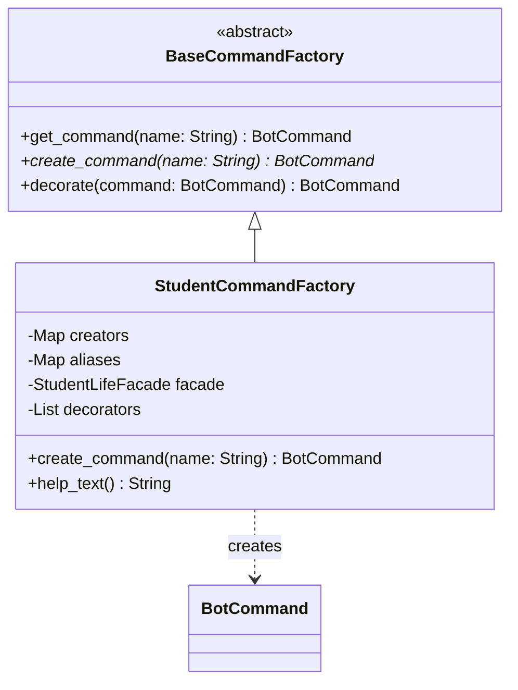

#### 2. Builder (`builders.py`)
- **Problema**: Obiectele precum `Task` sau `StudentProfile` au multiple atribute opționale și necesită validări complexe înainte de a fi create.
- **Soluție/Integrare**: Am implementat builderi fluenți care permit construcția pas-cu-pas și validarea datelor.
- **Roluri**: `TaskBuilder`, `HabitBuilder` gestionează starea internă și returnează entitatea finală.

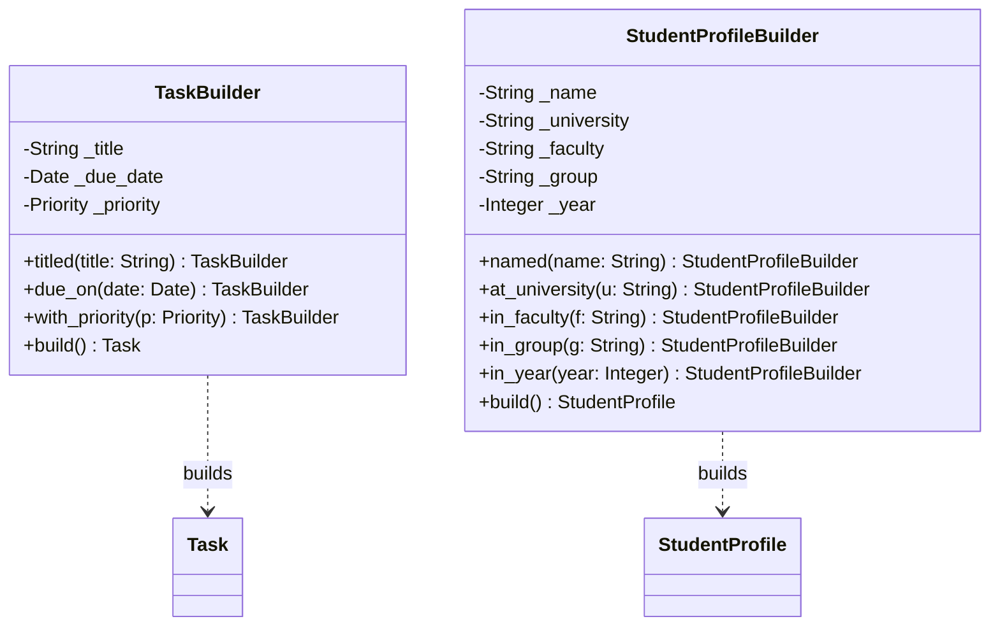

#### 3. Prototype
- **Problema**: Nevoia de a crea variații ale cererii inițiale fără a recompune manual întreg obiectul `CommandRequest`.
- **Soluție/Integrare**: Utilizarea metodei de clonare (prin `replace`) în `BotRouter`.
- **Roluri**: `CommandRequest` acționează ca un prototip pentru noile instanțe de cerere.

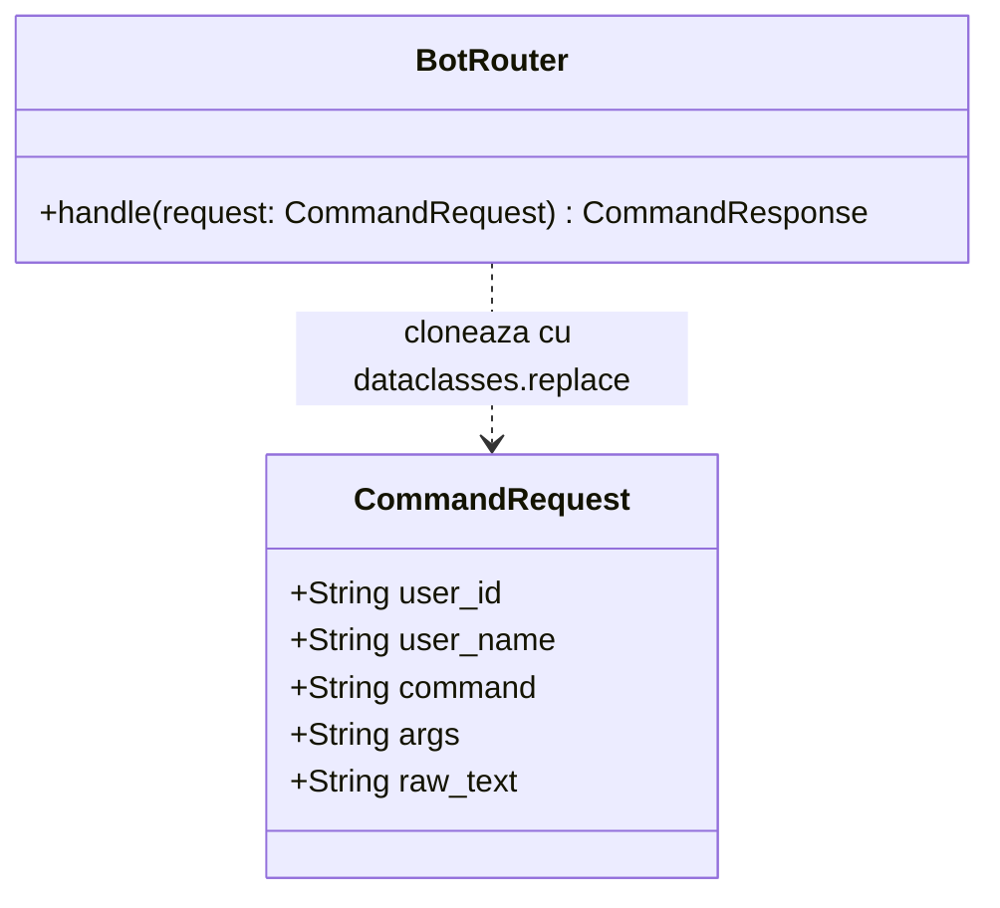

#### 4. Abstract Factory
- **Problema**: Gestionarea coerentă a unor familii de obiecte corelate (comenzi de tip submeniu).
- **Integrare**: Arhitectura permite definirea unor fabrici specializate pentru seturi de comenzi compatibile.
- **Roluri**: Interfață pentru crearea familiilor de obiecte fără a specifica clasele lor concrete.

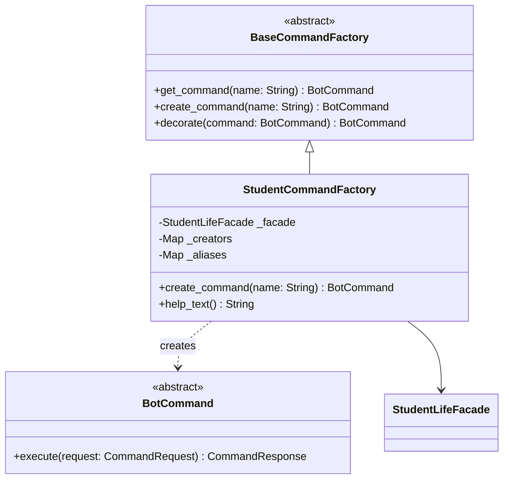

### 2.2. Pattern-uri Structurale (Structural)

#### 5. Facade (`facade.py`)
- **Problema**: Comenzile bot-ului depind de subsisteme complexe: stocare, analytics și planificare.
- **Soluție/Integrare**: `StudentLifeFacade` coordonează intern toate aceste servicii.
- **Roluri**: Simplifică API-ul intern și decuplează logica de prezentare de cea de business.

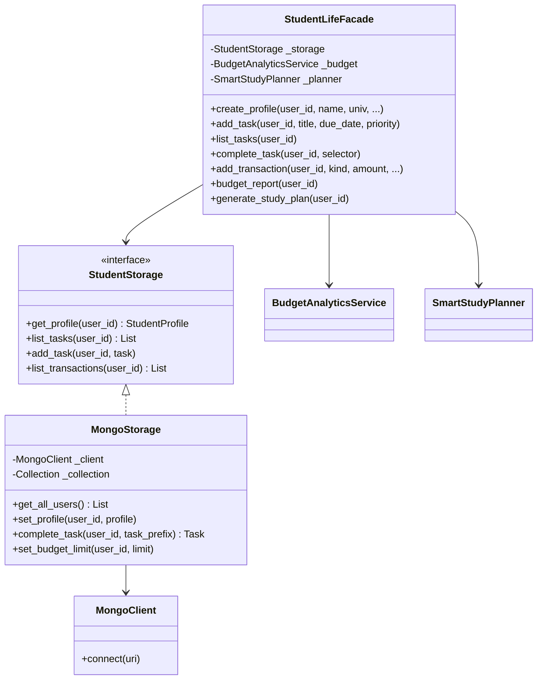

#### 6. Adapter (`adapters.py`)
- **Problema**: Incompatibilitatea între formatele de intrare (Telegram vs. Consolă).
- **Soluție/Integrare**: Traducerea obiectelor specifice platformei în `CommandRequest` unificat.
- **Roluri**: `TelegramUpdateAdapter`, `ConsoleAdapter` ca mediatori de interfață.

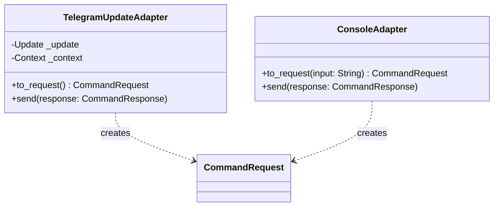

#### 7. Decorator (`decorators.py`)
- **Problema**: Adăugarea de logging sau error handling fără a modifica clasa originală a comenzii.
- **Soluție/Integrare**: Wrappere peste funcțiile `execute` ale fiecărei comenzi.
- **Roluri**: `LoggingCommandDecorator`, `ErrorHandlingCommandDecorator`.

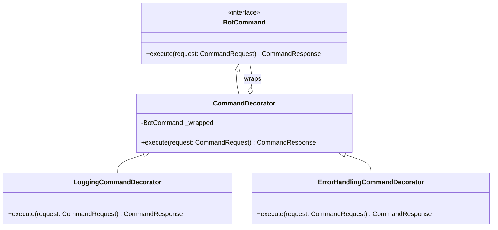

#### 8. Proxy (`ai.py`)
- **Problema**: Controlul accesului și gestiunea erorilor pentru API-ul extern de AI.
- **Soluție/Integrare**: Modulul `ai.py` gestionează timeout-urile și formatarea răspunsurilor externe.
- **Roluri**: Intermediar care controlează accesul la resurse costisitoare.

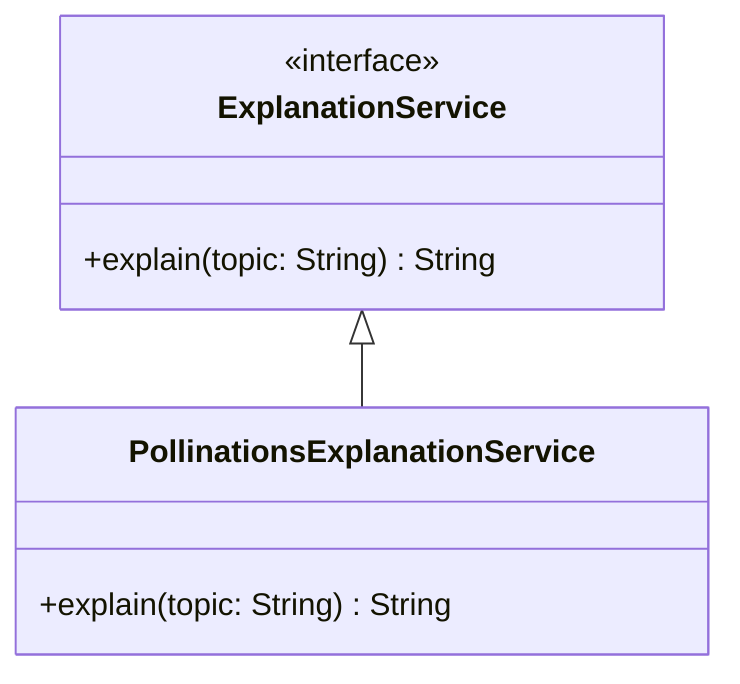

### 2.3. Pattern-uri Comportamentale (Behavioral)

#### 9. Command (`commands.py`)
- **Problema**: Încapsularea unei cereri ca obiect pentru uniformizarea execuției.
- **Soluție/Integrare**: Fiecare acțiune este o clasă ce implementează `BotCommand`.
- **Roluri**: `BotCommand` (interfață), `ConcreteCommand` (implementare).

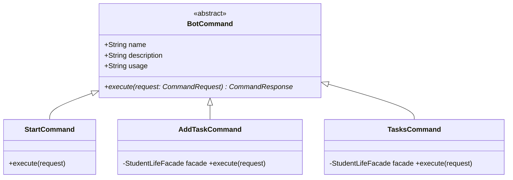

#### 10. Strategy (`strategies.py`)
- **Problema**: Schimbarea algoritmului de sortare a task-urilor la runtime.
- **Soluție/Integrare**: Strategii interschimbabile (`DeadlineFirst`, `PriorityFirst`).
- **Roluri**: `TaskSortStrategy` definește familia de algoritmi de sortare.

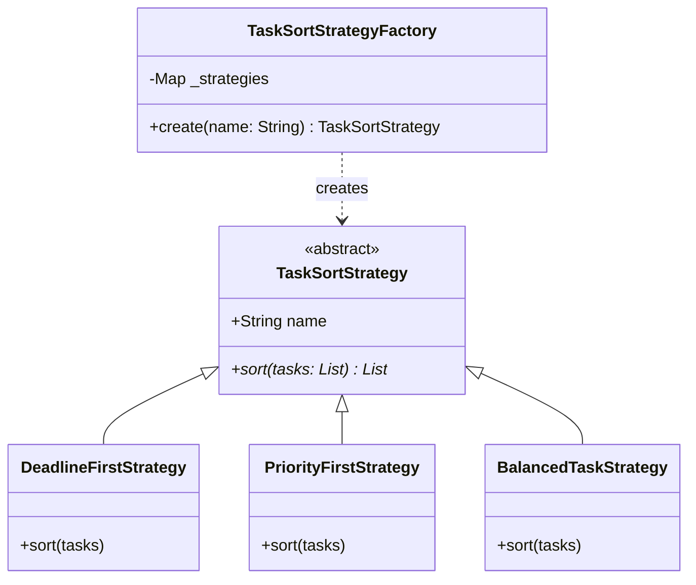

#### 11. Observer (`events.py`)
- **Problema**: Notificarea automată a modulelor la schimbarea stării altor obiecte.
- **Soluție/Integrare**: `EventBus` notifică observatorii de Achievement, Remindere și Buget.
- **Roluri**: `Subject` (EventBus) și `Observers` care reacționează la evenimente.

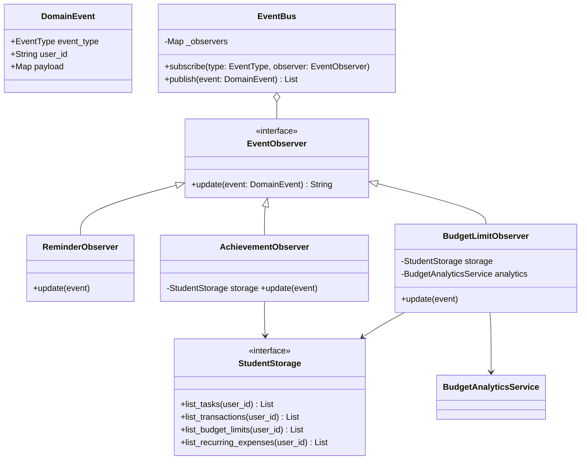

#### 12. Chain of Responsibility (`router.py`)
- **Problema**: Procesarea succesivă și condiționată a mesajelor primite.
- **Soluție/Integrare**: `BotRouter` trece mesajul prin diverse handlere de validare.
- **Roluri**: Evită cuplarea emițătorului de receptor prin delegare succesivă.

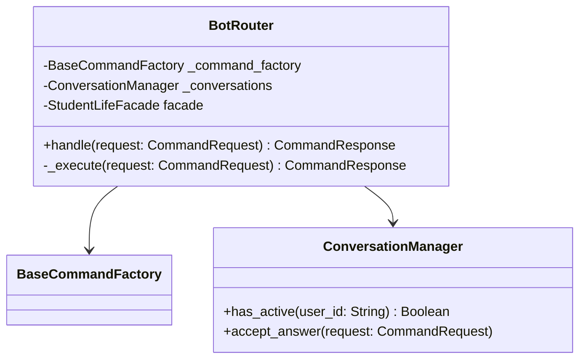

### 2.4. Respectarea Principiilor SOLID

Pentru a asigura o mentenabilitate ridicată și o structură modulară, proiectul respectă riguros principiile fundamentale ale programării orientate pe obiecte (SOLID):

1.  **Single Responsibility Principle (SRP)**: Fiecare componentă are o responsabilitate unică. Clasele de tip `BotCommand` se ocupă exclusiv de logica unei acțiuni, în timp ce `MongoStorage` gestionează doar persistența datelor, evitând astfel crearea unor obiecte de tip "God Object".
2.  **Open/Closed Principle (OCP)**: Sistemul este extensibil fără a necesita modificări în nucleu. Adăugarea unei funcționalități noi presupune crearea unei clase noi și înregistrarea ei în `CommandFactory`, lăsând neschimbată logica de rutare a mesajelor (`BotRouter`).
3.  **Liskov Substitution Principle (LSP)**: Toate implementările concrete ale comenzilor pot înlocui cu succes clasa abstractă `BotCommand`. De asemenea, strategiile de sortare sunt complet interschimbabile, asigurând că apelatorul nu trebuie să cunoască tipul specific al algoritmului.
4.  **Interface Segregation Principle (ISP)**: Utilizarea protocoalelor (ex: `EventObserver`, `ExplanationService`) asigură că modulele depind doar de metodele pe care le utilizează efectiv, prevenind cuplarea inutilă a componentelor.
5.  **Dependency Inversion Principle (DIP)**: Modulele de nivel înalt (Comenzile) depind de abstracțiuni (`StudentLifeFacade`, `AIProvider`) și nu de implementări concrete. Acest lucru facilitează, de exemplu, schimbarea furnizorului de AI sau a bazei de date fără a afecta codul de business.

---

## Capitolul 3 - Realizarea Aplicației (Implementare)

În această secțiune sunt prezentate funcționalitățile principale prin prisma interacțiunii cu utilizatorul.

### Figura 3.1. Meniul Principal și Navigarea
Interfața utilizează butoane de tip `ReplyKeyboardMarkup` pentru o navigare intuitivă. Meniul este structurat pe categorii logice (Task-uri, Orar, Finanțe).
*(Aici se va insera screenshot cu meniul bot-ului)*

### Figura 3.2. Managementul Task-urilor și Strategii
Afișarea listei de task-uri sortate conform strategiei alese. Se observă utilizarea emoji-urilor pentru status și urgență.
*(Aici se va insera screenshot cu lista de task-uri)*

### Figura 3.3. Analiza Bugetului și Predicții
Raportul detaliat de buget care include cheltuieli pe categorii și alerte de depășire a limitei.
*(Aici se va insera screenshot cu raportul de buget)*

---

## 🚀 Rularea cu Docker

Pentru o desfășurare rapidă și izolată, proiectul include suport pentru Docker.

### Pre-cerințe
- Docker și Docker Compose instalate.
- Fișierul `.env` configurat în rădăcina proiectului:
  ```env
  BOT_TOKEN=tokenul-tau
  MONGODB_URI=mongodb://localhost:27017
  MONGODB_DATABASE=student_life_helper
  MONGODB_COLLECTION=users
  TASK_STRATEGY=deadline
  ```
  În Docker, `docker-compose.yml` setează automat conexiunea internă către serviciul `mongo`.

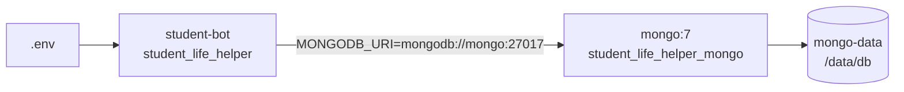

### Pași de rulare
1. Navigați în directorul de deployment:
   ```bash
   cd deploy/docker
   ```
2. Lansați containerul:
   ```bash
   docker-compose up -d --build
   ```
3. Verificarea log-urilor:
   ```bash
   docker logs -f student_life_helper_bot
   ```

---

## Concluzii
Proiectul **Student Life Helper** demonstrează utilitatea arhitecturii bazate pe design pattern-uri în dezvoltarea software modern, oferind modularitate, scalabilitate și robustețe.

## Bibliografie
1. **Gamma, E., Helm, R., Johnson, R., Vlissides, J.** - *Design Patterns: Elements of Reusable Object-Oriented Software*, 1994.
2. **Martin, Robert C.** - *Clean Architecture*, 2017.
3. **Telegram Bot API Documentation**, https://core.telegram.org/bots/api.

## Anexă: Repository GitHub
Codul sursă complet este disponibil la:
https://github.com/alexandrsparivac/TMPPP
